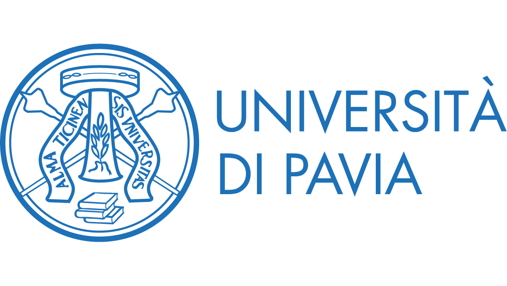
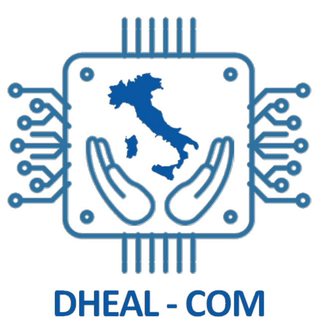

<div id="top"></div>

[![Contributors][contributors-shield]][contributors-url]
[![Forks][forks-shield]][forks-url]
[![Stargazers][stars-shield]][stars-url]
[![Issues][issues-shield]][issues-url]
[![MIT License][license-shield]][license-url]


<br />
<div align="center">
  <h2><br>OrientaMed</h2>
  <h3 align="center">Sistema conversazionale basato su LLMs e RAG per assistenza al triage</h3>
  
  [![Status][status-shield]][status-url]
  [![Version][version-shield]][version-url]

  <p align="center">
    <a href="https://github.com/detsutut/dheal-com-rag-demo"><strong>Explore the docs »</strong></a><br/><br/>
    <a href="https://github.com/detsutut/dheal-com-rag-demo/issues">Report Bug</a>·
    <a href="https://github.com/detsutut/dheal-com-rag-demo/issues">Request Feature</a>
  </p>
</div>

<div align="center"><span>&nbsp;&nbsp;&nbsp;&nbsp;&nbsp;&nbsp;</span><span>&nbsp;&nbsp;&nbsp;&nbsp;&nbsp;&nbsp;</span></div>

<!-- TABLE OF CONTENTS -->
<details>
  <summary>Table of Contents</summary>
  <ol>
    <li><a href="#about-the-project">About The Project</a></li>
    <li><a href="#installation">Installation</a></li>
    <li><a href="#publications">Publications</a></li>
    <li><a href="#contacts-and-useful-links">Contacts And Useful Links</a></li>
    <li><a href="#license">License</a></li>
  </ol>
</details>

<!-- ABOUT THE PROJECT -->
## About The Project

Lorem Ipsum Dolor Sit Amet

**Keywords**: *RAG, NLP, LLM, large language models, gradio, langchain, chatbot, generative AI, traige, decision support system.*

<p align="right"><a href="#top">↰ Back To Top</a></p>

<!-- INSTALLATION -->
## Installation

1. Make sure you have the latest version of pip installed
    ```sh
    pip install --upgrade pip
    ```
2. Install dependencies from requirements
    ```sh
    pip install -r --no-cache-dir requirements.txt
    ```
3. Run the Gradio app
    ```sh
    python3 app.py
    ```

<p align="right"><a href="#top">↰ Back To Top</a></p>

<!-- PUBLICATIONS -->
## Publications

List of publications involving OrientaMed

* TM Buonocore, E Cardinale, G Sakellariou, R Bellazzi, and L Sacchi - Enhancing RAGs for Rheumatology Triage: Strategies for Optimized Knowledge Retrieval - Prepring ([link](https://www.sciencedirect.com/science/article))

<!-- CONTACTS AND USEFUL LINKS -->
## Contacts and Useful Links

*   **Repository maintainer**: Tommaso M. Buonocore  [![Gmail][gmail-shield]][gmail-url] [![LinkedIn][linkedin-shield]][linkedin-url]  

*   **Project Link**: [https://github.com/detsutut/dheal-com-rag-demo](https://github.com/detsutut/dheal-com-rag-demo)

<p align="right"><a href="#top">↰ Back To Top</a></p>

<!-- LICENSE -->
## License

Distributed under MIT License. See `LICENSE` for more information.

<p align="right"><a href="#top">↰ Back To Top</a></p>

<!-- MARKDOWN LINKS -->
[contributors-shield]: https://img.shields.io/github/contributors/detsutut/dheal-com-rag-demo.svg?style=for-the-badge
[contributors-url]: https://github.com/detsutut/dheal-com-rag-demo/graphs/contributors
[status-shield]: https://img.shields.io/badge/Status-pre--alpha-blue
[status-url]: https://github.com/detsutut/dheal-com-rag-demo/releases
[version-shield]: https://img.shields.io/github/v/release/dheal-com-rag-demo/dheal-com-rag-demo?include_prereleases
[version-url]: https://github.com/detsutut/dheal-com-rag-demo/releases
[forks-shield]: https://img.shields.io/github/forks/detsutut/dheal-com-rag-demo.svg?style=for-the-badge
[forks-url]: https://github.com/detsutut/dheal-com-rag-demo/network/members
[stars-shield]: https://img.shields.io/github/stars/detsutut/dheal-com-rag-demo.svg?style=for-the-badge
[stars-url]: https://github.com/detsutut/dheal-com-rag-demo/stargazers
[issues-shield]: https://img.shields.io/github/issues/detsutut/dheal-com-rag-demo.svg?style=for-the-badge
[issues-url]: https://github.com/detsutut/dheal-com-rag-demo/issues
[license-shield]: https://img.shields.io/github/license/detsutut/dheal-com-rag-demo.svg?style=for-the-badge
[license-url]: https://github.com/detsutut/dheal-com-rag-demo/blob/master/dheal-com-rag-demo/LICENSE
[linkedin-shield]: 	https://img.shields.io/badge/LinkedIn-0077B5?style=for-the-badge&logo=linkedin&logoColor=white
[linkedin-url]: https://linkedin.com/in/tbuonocore
[gmail-shield]: https://img.shields.io/badge/Gmail-D14836?style=for-the-badge&logo=gmail&logoColor=white
[gmail-url]: mailto:tommaso.buonocore@unipv.it
